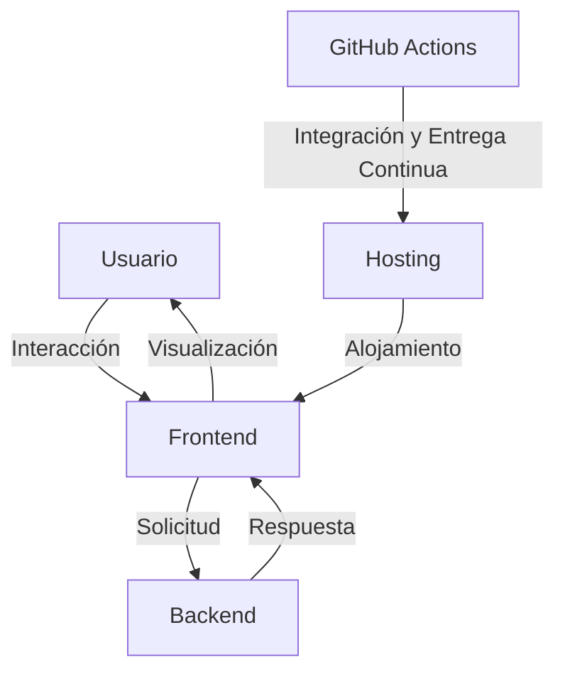

# Arquitectura del Proyecto "Hola Mundo"

## Resumen

El proyecto "Hola Mundo" es una aplicación web estática simple diseñada para probar el sistema. Este documento detalla la arquitectura del proyecto, incluyendo los componentes, capas, patrones y decisiones técnicas.

## Componentes

### Frontend

- **HTML5**: Para la estructura de la página web.
- **CSS3**: Para el estilo y diseño de la página web.
- **JavaScript vanilla**: Para la lógica de negocio y la interacción del usuario.

### Backend (opcional)

- **Node.js**: Para el entorno de ejecución del servidor.
- **Express**: Para el framework de aplicación web.

### Hosting

- **Vercel**: Para el alojamiento de la aplicación web estática.
- **Netlify**: Para el alojamiento de la aplicación web estática.
- **GitHub Pages**: Para el alojamiento de la aplicación web estática.

### CI/CD

- **GitHub Actions**: Para la integración y entrega continua.

## Capas

### Capa de Presentación

- **HTML5**: Para la estructura de la página web.
- **CSS3**: Para el estilo y diseño de la página web.
- **JavaScript vanilla**: Para la lógica de negocio y la interacción del usuario.

### Capa de Lógica de Negocio

- **Node.js**: Para el entorno de ejecución del servidor.
- **Express**: Para el framework de aplicación web.

### Capa de Datos

- **No aplica**: La aplicación web estática no requiere una capa de datos.

### Capa de Hosting

- **Vercel**: Para el alojamiento de la aplicación web estática.
- **Netlify**: Para el alojamiento de la aplicación web estática.
- **GitHub Pages**: Para el alojamiento de la aplicación web estática.

### Capa de CI/CD

- **GitHub Actions**: Para la integración y entrega continua.

## Patrones

### Patrón de Diseño de Arquitectura

- **Arquitectura en Capas**: Para separar las responsabilidades de la aplicación web estática.

### Patrón de Diseño de Código

- **MVC (Modelo-Vista-Controlador)**: Para separar la lógica de negocio, la interfaz de usuario y la gestión de datos.

## Decisiones Técnicas

### Tecnologías Frontend

- **HTML5**: Para la estructura de la página web.
- **CSS3**: Para el estilo y diseño de la página web.
- **JavaScript vanilla**: Para la lógica de negocio y la interacción del usuario.

### Tecnologías Backend (opcional)

- **Node.js**: Para el entorno de ejecución del servidor.
- **Express**: Para el framework de aplicación web.

### Hosting

- **Vercel**: Para el alojamiento de la aplicación web estática.
- **Netlify**: Para el alojamiento de la aplicación web estática.
- **GitHub Pages**: Para el alojamiento de la aplicación web estática.

### CI/CD

- **GitHub Actions**: Para la integración y entrega continua.

## Diagrama de Arquitectura

## Conclusiones

La arquitectura propuesta es una aplicación web estática simple, utilizando HTML5, CSS3 y JavaScript vanilla para el frontend, y Node.js con Express para el backend (si es necesario). La aplicación se alojará en servicios estáticos como Vercel, Netlify o GitHub Pages, y se utilizará GitHub Actions para la integración y entrega continua.

## Recomendaciones

- **Realizar una investigación de usuarios**: Para identificar las necesidades de los usuarios y desarrollar una aplicación que se adapte a sus necesidades.
- **Definir personas y mapas de experiencia del usuario**: Para desarrollar una aplicación que se adapte a las necesidades de los usuarios.
- **Realizar pruebas de penetración**: Para identificar vulnerabilidades en la aplicación y desarrollar una aplicación segura.
- **Realizar una revisión de código**: Para identificar vulnerabilidades en la aplicación y desarrollar una aplicación segura.

## GANT

El siguiente es el GANT del proyecto:

| Tarea | Duración | Fecha de inicio | Fecha de fin |
| --- | --- | --- | --- |
| Configuración inicial | 2 días | 2024-09-01 | 2024-09-03 |
| Desarrollo frontend | 4 días | 2024-09-04 | 2024-09-08 |
| Desarrollo backend | 2 días | 2024-09-09 | 2024-09-11 |
| Pruebas y depuración | 2 días | 2024-09-12 | 2024-09-14 |
| Documentación y entrega | 1 día | 2024-09-15 | 2024-09-15 |